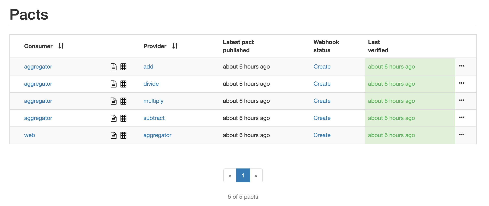

# contract testing using pact

We seem to be in constant confusion when it comes to testing dependencies between our services. This repo attempts to identify one possible solution using [pact](https://docs.pact.io/).

The services within implement a rudimentary calculator with;
  * f/e built using react
  * aggregator (graphql)
  * services (add, divide, multiply and subtract)
  
## dependencies
* node
* yarn
* docker
  
## setup
`yarn`
  
## build
This stage will likely take a few minutes to complete.
`docker-compose build`

## run
Run the following command.
`docker-compose up`
Once complete navigator to [http://localhost:3000](http://localhost:3000) and your should see something similar to


Once you've got an idea of what the app is trying to achieve stop `docker-compose` via _ctrl+c_. This stops ports conflicting when you come to test using pact.

## testing
To contract test the interactions start by generating the `pact` configurations for each of the consumers. From the root of the repository run the following command.
```
yarn test:consumer
```

Once the `pact` files have been generated we need somewhere to publish them. For this run the following command
```
bin/broker.sh
```
Once this has completed navigate to the [broker](http://localhost:9292) in your browser. Remove the existing _example_ pact from the table presented in your browser (use the elipsis at the end of the table row).

Back in your terminal run `yarn test:publish` to publish the _PACTS_ to the test broker. Once complete refresh your browser, you should see the _PACTS_ appear as rows within the table.

Finally to test the _PACTS_ create the service stubs by running
```
pact-stub-service --port 3000 packages/aggregator/pacts/
```
and then execute the tests by running
```
yarn test:provider
```

Once complete navigate back to your browser and you should see something similar to the following

Hopefully the column on the left is green for you 👍

## can i deploy my changes
This is a common question and from a contract (pact) point of view the answer is wrapped up in the command `pact-broker can-i-deploy`. So to get an idea if the changes you've made are safe to deploy you can run the following commands for each of the services within this repository
```
for service in {'web','aggregator','add','divide','multiply','subtract'}; do pact-broker can-i-deploy --pacticipant $service --latest --broker-base-url=http://localhost:9292; done
```
We can run this within our pipelines to make decisions about what services within our platform can be deployed.
